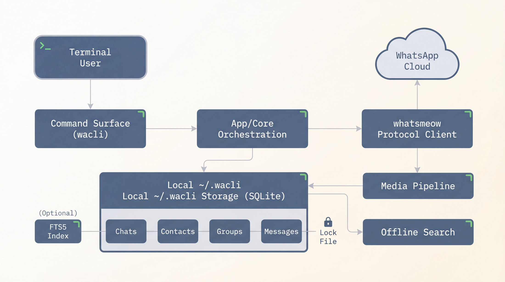

# wacli

> Sync, search, and send WhatsApp messages from your terminal.



`wacli` is a third-party WhatsApp CLI built on top of [`whatsmeow`](https://github.com/tulir/whatsmeow). It is designed for people who want a local message store, fast offline search, and terminal-native workflows for auth, sync, search, media, and send.

**Not affiliated with WhatsApp.** `wacli` uses the WhatsApp Web protocol via `whatsmeow`.

## What wacli does

- Authenticate as a linked WhatsApp device via QR
- Sync message history into a local store at `~/.wacli`
- Keep following live updates with a long-running sync loop
- Search messages offline
- Send text messages and files
- Inspect chats, contacts, and groups
- Download synced media
- Emit JSON output for automation-friendly workflows

## System architecture

At a high level, `wacli` looks like this:

- **CLI surface**: commands like `auth`, `sync`, `messages search`, `send text`, and `media download`
- **App / orchestration layer**: coordinates auth, sync, send, search, media, and command behavior
- **Local store**: SQLite-backed state under `~/.wacli` for chats, contacts, groups, messages, and metadata
- **Optional FTS5 index**: enables faster offline search when SQLite FTS5 is available
- **Locking model**: protects the store so one long-running sync owner does not collide with other commands
- **Transport layer**: `whatsmeow` handles the WhatsApp Web protocol connection
- **Network edge**: sync, auth, send, and media operations ultimately go through the WhatsApp network

## Install / build

Choose one path:

### Option A — Homebrew

```bash
brew install steipete/tap/wacli
```

### Option B — Build locally

```bash
go build -tags sqlite_fts5 -o ./dist/wacli ./cmd/wacli
```

If you build locally, use `./dist/wacli` in the examples below.

## Quick start

Default store directory is `~/.wacli`.

```bash
# 1) Authenticate (shows QR), then bootstrap sync
wacli auth

# 2) Keep syncing (never shows QR; requires prior auth)
wacli sync --follow

# 3) Diagnostics
wacli doctor

# 4) Search messages
wacli messages search "meeting"

# 5) Send a text message
wacli send text --to 1234567890 --message "hello"

# 6) Send a file
wacli send file --to 1234567890 --file ./pic.jpg --caption "hi"

# 7) List groups and rename one
wacli groups list
wacli groups rename --jid 123456789@g.us --name "New name"
```

## Common workflows

### Search local messages

```bash
wacli messages search "invoice"
wacli messages list --chat 1234567890@s.whatsapp.net --limit 50
```

### Download media for a synced message

```bash
wacli media download --chat 1234567890@s.whatsapp.net --id <message-id>
```

### Backfill older history for a chat

```bash
wacli history backfill --chat 1234567890@s.whatsapp.net --requests 10 --count 50
```

## Backfilling older history

`wacli sync` stores whatever WhatsApp Web sends opportunistically. To fetch older messages, `wacli` can request on-demand history sync from your **primary device**.

Important notes:

- This is **best-effort**. WhatsApp may not return full history.
- Your **primary device must be online**.
- Requests are **per chat**.
- `wacli` uses the oldest locally stored message in a chat as the anchor.
- Recommended `--count` is `50` per request.

Backfill one chat:

```bash
wacli history backfill --chat 1234567890@s.whatsapp.net --requests 10 --count 50
```

Backfill all known chats from the local DB:

```bash
wacli --json chats list --limit 100000 \
  | jq -r '.[].JID' \
  | while read -r jid; do
      wacli history backfill --chat "$jid" --requests 3 --count 50
    done
```

## Storage model

By default, `wacli` stores its local state in `~/.wacli`.

That store contains:

- WhatsApp session / linked-device state
- local SQLite data for chats, contacts, groups, and messages
- optional search index data
- lock state for long-running sync ownership

Treat it as sensitive local application data.

## Environment overrides

- `WACLI_DEVICE_LABEL`: set the linked device label shown in WhatsApp
- `WACLI_DEVICE_PLATFORM`: override the linked device platform (defaults to `CHROME` if unset or invalid)

## Output modes

By default, output is human-readable.

Use JSON when you want to automate around `wacli`:

```bash
wacli --json doctor
wacli --json chats list
wacli --json messages search "budget"
```

## Status

Core implementation is in place and actively evolving. See [`docs/spec.md`](docs/spec.md) for deeper design notes.

## Prior art / credit

This project is heavily inspired by and learns from Vicente Reig’s excellent `whatsapp-cli`:

- [`whatsapp-cli`](https://github.com/vicentereig/whatsapp-cli)

## License

See [`LICENSE`](LICENSE).
